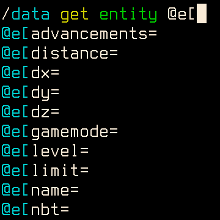

# JLine for Minecraft Dedicated Server

A server side mod to enable command history, auto completion and syntax
highlighting on the server console. Should have zero impact on the gameplay.

Fabric is the only supported mod loader, fabric api is not required by this mod.

This mod is configurable using `jline4mcdsrv.toml`:
* `logPattern` is the pattern used for Log4J (documentation [here](https://logging.apache.org/log4j/2.x/manual/layouts.html#Patterns))
*  `highlightColors` is a list of colors used to highlight parameters in order
   (see image above for an example)

This is my first mod for Minecraft. Actually this is also the first time for me
to do anything serious using Java. So please be gentle if you want to roast my
code.
