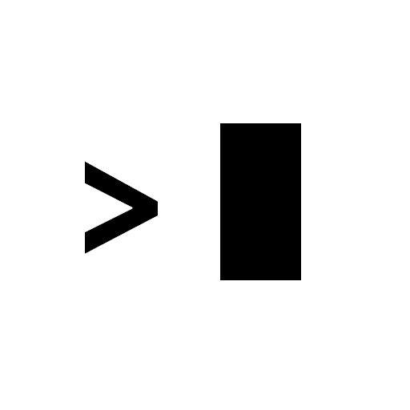
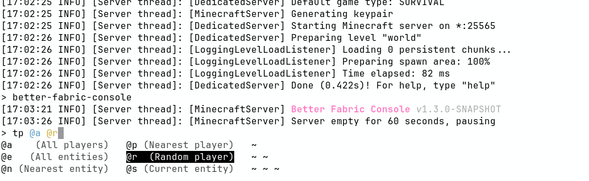

# Better Fabric Console



Better Fabric Console is a server-side Fabric mod that replaces the vanilla dedicated server console experience with an interactive, color-aware terminal.

## Features

- Brigadier-aware command completion in the server console
- Command syntax highlighting with configurable argument colors
- Colored log output in terminal consoles
- Persistent command history in `.console_history`
- Optional logging of player-executed commands
- Optional Endermux remote console server



## Requirements

- Fabric server
- [Fabric API](https://modrinth.com/mod/fabric-api)
- [adventure-platform-fabric](https://modrinth.com/mod/adventure-platform-mod)

## Installation

1. Download the latest Better Fabric Console, Fabric API, and adventure-platform-fabric jars.
2. Place the jars in your server `mods/` directory.
3. Start the server once to generate config files.
4. Stop the server and edit configuration as needed.
5. Start the server again.

You may also choose to run the server with the `--nogui` argument (i.e. `java -jar fabric.jar --nogui`)
to disable the server GUI (this is a Vanilla option).

## Configuration

Better Fabric Console generates and reads:

- `config/better-fabric-console/better-fabric-console.conf`
- `config/better-fabric-console/log4j2.xml`

Default `better-fabric-console.conf` for reference:

```hocon
# Specify argument highlight colors, in order. Possible values: [BLACK, RED, GREEN, YELLOW, BLUE, MAGENTA, CYAN, WHITE]
highlight-colors=[
    CYAN,
    YELLOW,
    GREEN,
    MAGENTA,
    BLUE
]
# Whether to log commands executed by players to console.
log-player-executed-commands=true
# Endermux remote console server configuration.
endermux {
    # Whether to enable the Endermux remote console server.
    enabled=false
    # Path to the socket file relative to the server directory.
    socket-path="console.sock"
    # Maximum number of concurrent socket connections.
    max-connections=5
}
```

[Click here](src/main/resources/better-fabric-console-default-log4j2.xml) to see the default `log4j2.xml` configuration.

Better Fabric Console also respects the following system properties to override terminal environment detection:
- Adventure ANSI properties: https://docs.papermc.io/adventure/serializer/ansi/

Changes require a server restart.

## Endermux Remote Console Server

Better Fabric Console also includes the Endermux remote console server (disabled by default, see configuration above).

This allows for attaching to a fully-featured console session from a remote (over Unix domain socket) terminal using the Endermux client.

An example use case for this would be running the server as a systemd service and using Endermux when an interactive console is needed.

## Command

- `/better-fabric-console` (operator-level): Prints mod version information.

## License

MIT. See `license.txt`.
